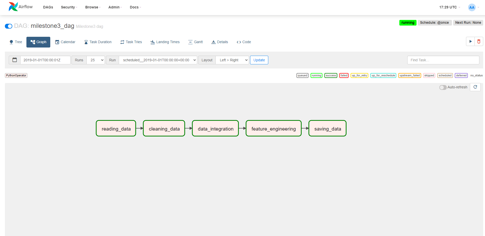
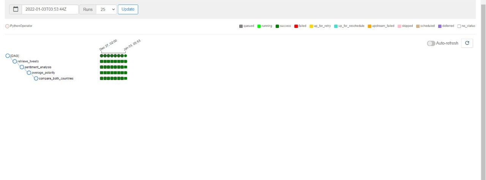

# Olympics-Analysis Project

 # Milestone 1
 
 
 **Data Overview**
 
The datasets used are  public datasets of **120 years of Olympic history: athletes and results** can be found on kaggle [https://www.kaggle.com/heesoo37/120-years-of-olympic-history-athletes-and-results?select=athlete_events.csv] 

these dataset contains data about historical info about olympics from Athens 1896 to Rio 2016.
the first dataset,athlete_events.csv, contains info athelets that participate in the olympics

It has 71116 rows by  15 columns

ID - Unique number for each athlete

Name - Athlete's name

Sex - M or F

Age - Integer;

Height - In centimeters

Weight - In kilograms

Team - Team name

NOC - National Olympic Committee 3-letter code

Games - Year and season

Year - Integer

Season - Summer or Winter

City - Host city

Sport - Sport

Event - Event

Medal - Gold, Silver, Bronze, or NA

the second data set,noc_regions.csv, contains more info about the regoins of the partipcants
NOC - National Olympic Committee 3-letter code;	
region  - Region name of the particpant;	
notes - additional nots; 

**Overview of the Milestone 1 goals**
Such important dataset contains useful information if investigated in smart way can lead us into more useful insights. 
These insights can be useful in improving participants performance or give more attention to specific group of people and more!

**MS1 Content**

**Data Importing:** importing the data using pandas 

**Data merging:** merging the 2 datasets on 'NOC' Columns

**Exploratory Data Analysis :** analyzing the distribution of the numerical column, investigating, max, min, unique and  missing values.

**Data Preprocessing :** Imputation,encoding, detecting and handling outliers. 

**Imputation** is done in all the columns using different ways. 

notes columns is deleted becuese it has more than 90% missing
medals columns is considered MNAR so it 's cosidered that the missing data are no medals 
Age colunm is imputed using the median age of the corresponding sport "mapping"
region colunm is imputed using the same way as the age but using the corresponding median NOC
Weight is imputed linear regression based on  height age and sex
Height is imputed as weight but based on weight age and sex 

**Encoding:** Sex and Medals are encoded using one-hot encoding

**Outliers Handeling** the outliers are detected using IQR on age weight height columns  then are sperated on different dataset to more investigation 
also used multivariate techinque on weight and height columns 

**Data Visualization** different graphs are plotted to investigate more about the data using different questions 

**Data exploration questions** The questions proposed are regardign the egyptians in olympics

**How is their performance , does it improve ?**

**what are the sports in which they could achieve medals and how are their performance over years ?**

**what are the games in which their performance decreaes** 

**Does the number of women increase over years ?** 

**what are the sports they do over years and which attracts them mostly ?**

**does their performance improve over years ?** 

in addition to more questions are answered in the data visualization

# Milestone 2

**Data Overview**

The datasets used are the previous used in MS1 in addition to [https://www.kaggle.com/arjunprasadsarkhel/2021-olympics-in-tokyo].
The new medals dataset contains info about the participated teams in 2021 

It has 93	rows by 7 columns

Rank - Rank based on gold medals

Team/NOC - Participated team name in 2021

Gold Medal

Silver Medal

Bronze Medal

Total 

Rank by Total Rank based on total medals

I added a new columny ('Year') that has value 2021 and disposed of Ranks columns.

**MS2 Content**

**Data Importing:** importing the medals data using pandas

**Unification:** Unify Country name in all table to be able to merge

**Aggregation:** Convert MS1(Clean+outliers) dataset into new dataset. This dataset containt contains on new Feateres or columns , gold , silver ant total, These features sum the medals of the corrsesponding team and year. 

**Integration:** It doesn't matter if we join the tables or append them because the medals dataset is in a 2021. However, The recent year in MS1 aggregated dataset is 2016.

So I thought It's better to append The Aggregated and Medals dataset not join them. 

**Answering new Research Questions using this integration and the newly aggregated dataset**

**Did Japan performance increase when hosted the olympics in 2021 ?**

**What is the team that his performance change the most between 2016 and 2021?**

**Does the team participating the most get the most medals in 2016?**

**Features Engineering**

**2 New Feature Engineered to the cleaned MS1 dataset(Athletes)**

1. The BMI Group: it categorizes participants based on their BMI score. The BMI Score is calculated as (Weight/((Height/100)*(Height/100))). This feature is based on the weight and height of the participant. It is important in classifying the participant to know whether he is Underweight, Normal, Overweight, or Obese. This classificaiton is important to know in order to know which players can compete with each other and who can participate in which sport based on his BMI.if BMI is less than 18.5 then this person is underweight, if the bmi is less than 25 then he is considered normal, if the bmi is less than 30 then he is considered overweight, otherwise he is considered Obese.

2. The Age Group feature: We added the Age Group feature based on age range. We divided the age groups into Too Young, Youth, Middle Age, and Old Adult. It is important to know which age group a person is in in order to put him in the right category of competence when a person participates in the Olympics. Ages less than 20 are classified as Too Young, ages between 20 and 30 are considered Youth, ages between 30 and 50 are categorized as Middle Age, ages between 50 and 100 are classified as Old Adults.
 
 **Theses feature highle helped in answeing new research questions**
 
**What is the sport that over weight people pefrom the best?**

**Does the team participating the most get the most medals in 2016?**
 
**Does over weight perfrom better than Non over weight in Athletics?**

**# What are the sports that old people performs better than youth ?**

In general the integration and the newly engineered feature don't help greatly in research question in MS1, As the questions in MS1 Could be almostly answered in MS1

 # Milestone 3
 The main purpose here is to build a Pipeline to extract, transform, Load dataset using Airflow.
 
 Therefore, we first imported the required libraries for airflow.
 
 Our pipeline consists of three main stages which are:
  1- **Extracting**: in this stage we load the csv files that we will need to process. The pre- mention datasets Athletes,Regions and Medals. 
  
  2- **Transforming**: in this stage we process and modify that data that we extracted, this stage consists of three main stages:
  
    1- Data cleaning: in this stage we detect the outliers and isolate them in different datasets, we also impute the missing values.
    
    2- Data integration: in this stage we unify country names with all tables because we noticed that the names of same countries in all tables were not exactly the same in            termes of comparing two strings, so it wouldn't have noticed that two different strings correspond to the same country, so we unified the names of all countries to be the same in all tables.
       We also aggregate the atheletes data, meaning that we return the total number of bronze, silver, gold, and total medals for each country (team) in a given year.
       Finally we integrate the aggregated atheletes data with medals, regions, and the outlier data that we extrated in the cleaning stage
       
    3- Finally we have the feature engineering stage where we add new features that we think are important. We added a new column that categorizes players' BMI (a quantity              derived from player's weight and height) in order to be able to put players with the right contestants and the right games. We also added a new column that categorizes          players based on their age group in order to put the player with the right contestants.
    
  3- Our final stage is the **Load** stage where we save the transformed data into our pc.
  
  
  Here are the dependencies:   reading data  -> cleaning data  -> data integraiton  -> feature engineering -> saving data.
  
  So first we read the data then we clean them, notice that reading stage has to complete in order for the cleaning stage to begin, then we have the integration stage, the         feature engineering stage, and then finally we save the transformed data into our pc.
  
  For simplicty, we extract and load the dataset in each stage. As it's not perfarable tp pass many pandas dataframes within pipeline stages using Airflow.
  ref:[https://www.astronomer.io/guides/airflow-passing-data-between-tasks]
  

 # Bonus Part
 The idea here is similar to MS3. Using Airflow , we build a scheduled pipeline to
 
 1- **Stream** tweets using tweeter APIs that is tracked on two partipating countries in Tokyo 2021 Egypt and USA. 20 tweets for each country.
 
 2- **Analayze** sentiment of these tweets using textblobs (positive sentiment when polarity >0 and Vice Versa).
 
 3- **Average** the analyzed sentimets for each country. 
 
 3- **compare and Save** the resulted average for each country in a csv file with its corresponding run time
 
  
  
  please not that the Airflow scritps are the .py ones not the .ipynb, the noteboos were for illustration.
